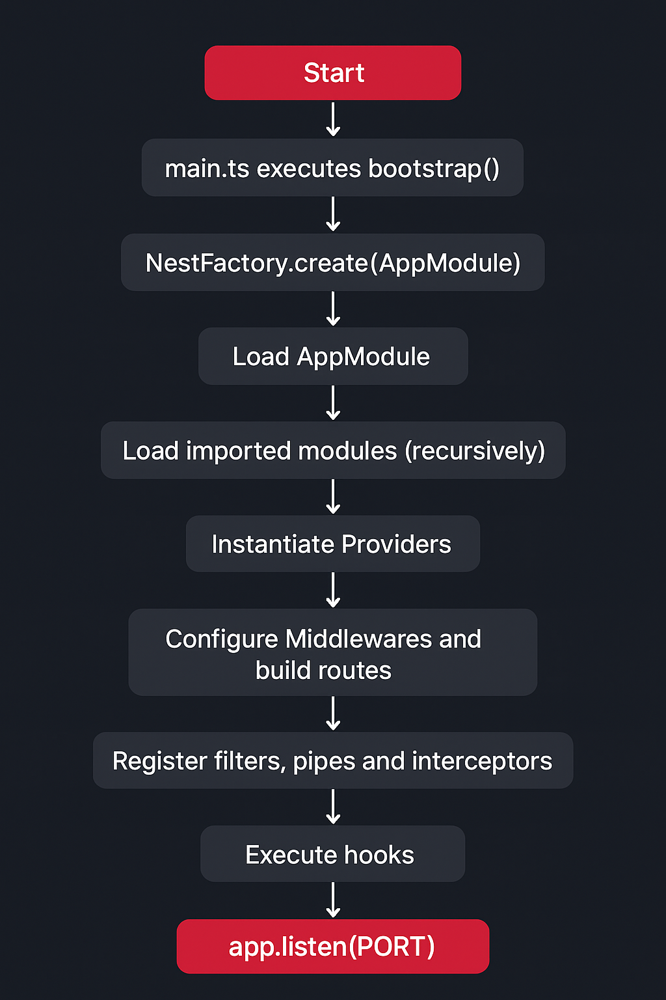

# ⚙️ Secuencia de inicio de una aplicación NestJS

[Volver a Inicio](../../README.md)

> Entender la secuencia de inicio (bootstrap) de NestJS ayuda muchísimo a depurar y optimizar la app.

## 1. Ejecución del archivo de entrada (main.ts)

- Se ejecuta el bootstrap() (normalmente una función async).
- Ejemplo típico:

```ts
async function bootstrap() {
  const app = await NestFactory.create(AppModule);
  await app.listen(3000);
}
bootstrap();
```

## 2. Creación del contexto de la aplicación (NestFactory.create(AppModule))

- Se instancia el módulo raíz (AppModule).
- Se crea el ApplicationContext, que administra los módulos, controladores, y proveedores.
- Se inicializa el container de inyección de dependencias (DI Container).

## 3. Carga del módulo raíz (AppModule)

- Nest analiza las metadatos del decorador @Module():

```ts
@Module({
  imports: [...],
  controllers: [...],
  providers: [...],
})
```

- Se registran sus imports, providers, y controllers.

## 4. Carga de los módulos importados

- Cada módulo listado en imports del AppModule se procesa recursivamente:
  - Se crea el contexto de cada módulo.
  - Se resuelven dependencias (providers, controllers, exports).

## 5. Instanciación de los proveedores (providers)

- Se instancian services, guards, pipes, interceptors, etc. registrados en cada módulo.
- Nest utiliza inyección de dependencias para resolver constructores.
- Los proveedores marcados como @Injectable() son creados una sola vez (singleton por módulo).

## 6. Instanciación de controladores (controllers)

- Después de tener todos los servicios disponibles, Nest crea las instancias de los controladores.
- Los controladores reciben sus dependencias automáticamente.

## 7. Inicialización de middlewares y rutas

- Se configuran middlewares (si los hay en main.ts o con configure() en Module).
- Se construyen las rutas del router (basadas en @Controller() y sus decoradores @Get(), @Post(), etc.).

## 8. Inicialización de interceptores globales, pipes y filtros

- Si se registraron globalmente (app.useGlobalPipes(), etc.), se inicializan en este punto.

## 9. Hook de ciclo de vida (onModuleInit)

- Si algún servicio o módulo implementa OnModuleInit, se ejecuta ahora.

## 10. La aplicación comienza a escuchar (app.listen(port))

- Se levanta el servidor HTTP (por defecto Express o Fastify).
- Nest imprime el log de arranque.

<div style="text-align: center;">
  
</div>

## 🧭 Diagrama de flujo

```txt
[Inicio del proceso]
        │
        ▼
📄 main.ts ejecuta bootstrap()
        │
        ▼
🏗️ NestFactory.create(AppModule)
        │
        ▼
📦 Cargar AppModule
        │
        ├──► Procesar metadatos del decorador @Module()
        │        ├─ imports[]
        │        ├─ controllers[]
        │        └─ providers[]
        │
        ▼
📚 Cargar módulos importados (recursivamente)
        │
        ▼
🧩 Instanciar Providers (services, guards, pipes, etc.)
        │
        ▼
🎮 Instanciar Controllers (inyección de dependencias)
        │
        ▼
🧱 Configurar Middlewares y construir rutas
        │
        ▼
⚙️ Registrar filtros, pipes e interceptores globales
        │
        ▼
🔁 Ejecutar hooks (onModuleInit, onApplicationBootstrap)
        │
        ▼
🚀 app.listen(PORT)
        │
        ▼
✅ Aplicación NestJS lista y escuchando
```

## 💻 Pseudocódigo comentado

```ts
// main.ts
async function bootstrap() {
  // 1️⃣ Crear la aplicación con el módulo raíz
  const app = await NestFactory.create(AppModule);

  // 2️⃣ Configurar middlewares, pipes, interceptores globales (si aplica)
  app.useGlobalPipes(new ValidationPipe());
  // ...

  // 3️⃣ Iniciar el servidor
  await app.listen(3000);
}
bootstrap();

// 🧩 AppModule
@Module({
  imports: [UsersModule, AuthModule], // 4️⃣ Se cargan recursivamente
  controllers: [AppController], // 5️⃣ Se crean después de providers
  providers: [AppService], // 6️⃣ Se instancian primero
})
export class AppModule implements OnModuleInit {
  onModuleInit() {
    console.log("✅ AppModule inicializado");
  }
}

// 🚀 Flujo interno de NestFactory.create(AppModule)
function createApplicationContext(AppModule) {
  // a. Crear contenedor de inyección (DI container)
  // b. Analizar metadatos del módulo raíz
  // c. Registrar y resolver dependencias de todos los módulos importados
  // d. Instanciar providers y luego controllers
  // e. Construir las rutas HTTP
  // f. Ejecutar hooks de inicialización
}
```

## 🔁 Resumen simplificado:

| Paso | Descripción                            |
| ---- | -------------------------------------- |
| 1    | Se ejecuta `main.ts`                   |
| 2    | Nest crea el contexto y módulo raíz    |
| 3    | Se cargan módulos importados           |
| 4    | Se instancian providers                |
| 5    | Se instancian controladores            |
| 6    | Se configuran middlewares y rutas      |
| 7    | Se aplican pipes/interceptores/filtros |
| 8    | Se ejecutan hooks (`onModuleInit`)     |
| 9    | Se levanta el servidor (`app.listen`)  |

[Volver a Inicio](../../README.md)
