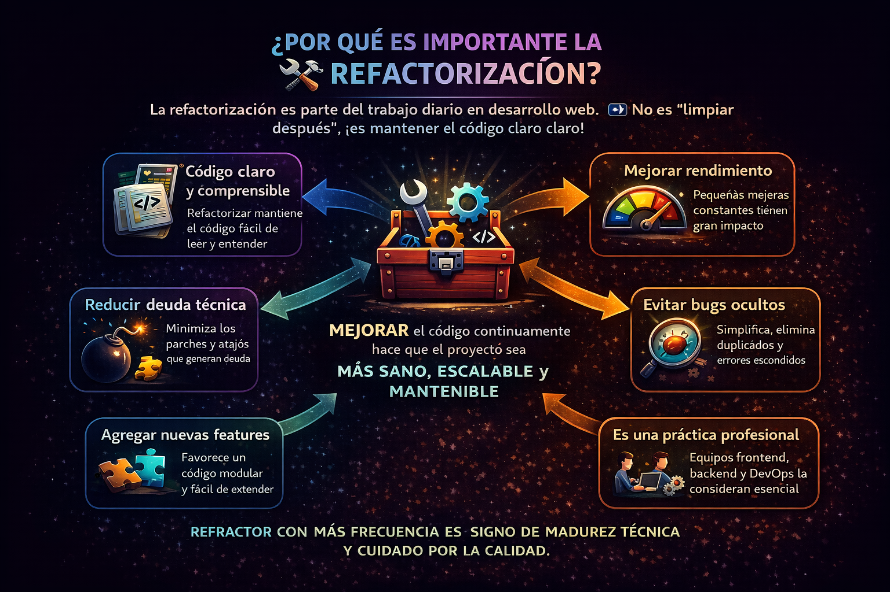

# 📚 REFACTORIZACIÓN

[Volver a Inicio](../../README.md)

- La refactorización es una parte esencial del desarrollo web, no una tarea ocasional ni algo que se hace “cuando hay tiempo”.
- Es una práctica continua orientada a mantener el código saludable, escalable y fácil de mantener.
- Refactorizar no es “limpiar después” ni una tarea opcional.
- Su objetivo es mejorar la calidad interna del código sin modificar su comportamiento externo.

## 🔍 ¿Por qué la refactorización es parte del trabajo diario?

En desarrollo web, refactorizar forma parte del día a día porque:

### 1️⃣ Mantiene el código legible y comprensible

- A medida que el proyecto crece, también lo hace su complejidad.
- Refactorizar evita que el código se vuelva difícil de leer, entender y modificar.

### 2️⃣ Reduce la deuda técnica

- Atajos, parches rápidos y decisiones apresuradas generan deuda técnica.
- La refactorización la reduce de forma progresiva, antes de que se convierta en un problema crítico.

### 3️⃣ Facilita la incorporación de nuevas funcionalidades

- Un código limpio, modular y bien organizado permite avanzar más rápido.
- Reduce el riesgo de romper funcionalidades existentes al agregar nuevas features.

### 4️⃣ Mejora la arquitectura y el rendimiento

- Pequeñas mejoras continuas tienen un impacto real tanto en backend como en frontend.
- Favorece una arquitectura más clara y sostenible en el tiempo.

### 5️⃣ Disminuye la aparición de bugs

- Al simplificar estructuras complejas, se reducen errores ocultos y comportamientos inesperados.

### 6️⃣ Es una práctica profesional

- Equipos de backend, frontend, fullstack y DevOps consideran la refactorización como parte natural del proceso de desarrollo.
- Refactorizar es una señal de madurez técnica y cuidado por la calidad del software.

  

---

[Volver a Inicio](../../README.md)
