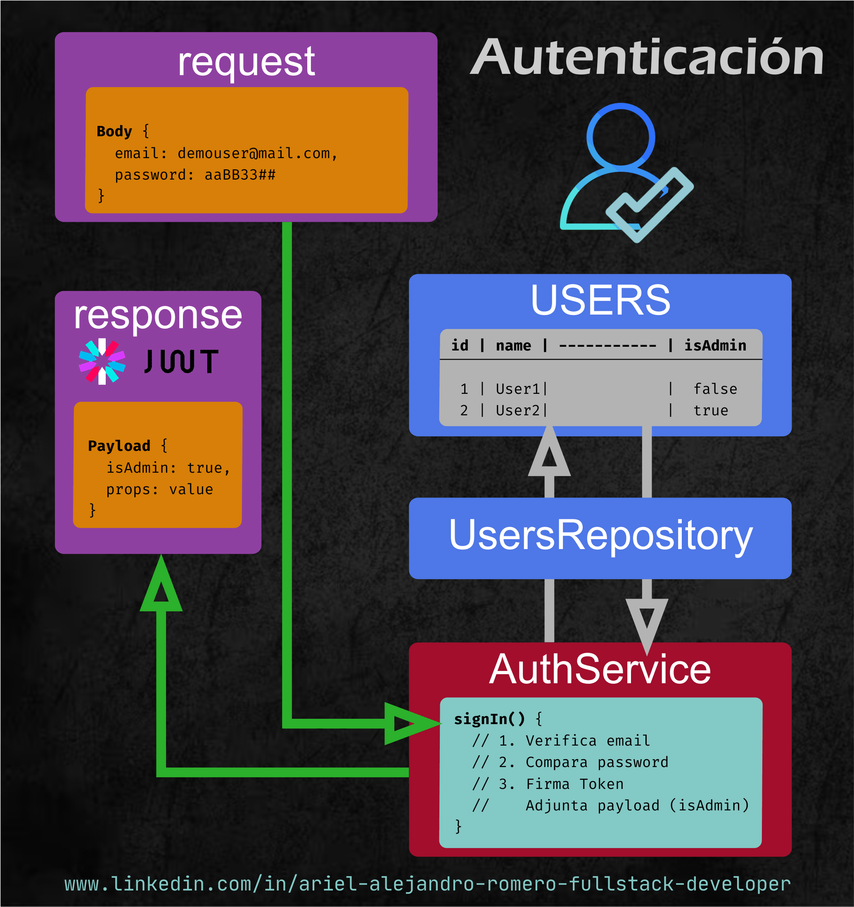
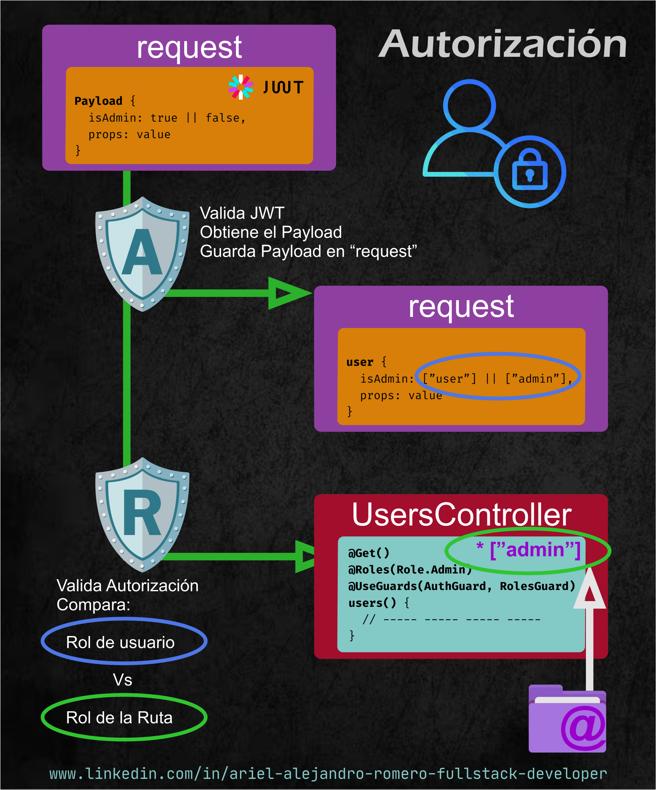

# Nest JS - Nest JS Authentication II

[Volver a Inicio](../../README.md)

## 👤 Autenticación



## 🔐 Autorización



---

## 🔄 DATAFLOW: AUTENTICACIÓN Y AUTORIZACIÓN (JWT)

```txt
╔═══════════════════════════════════════════════════════════════════╗
║          DATAFLOW: AUTENTICACIÓN Y AUTORIZACIÓN (JWT)             ║
╚═══════════════════════════════════════════════════════════════════╝


════════ VALIDAR IDENTIDAD DEL USUARIO Y ROL (Autenticación) ════════

┌───────────────────────────────────────────────────────────────────┐
│ 1) LOGIN REQUEST                                                  │
├───────────────────────────────────────────────────────────────────┤
│ El cliente envía por BODY:                                        │
│    { username, password }                                         │
└───────────────────────────────────────────────────────────────────┘
                              │
                              ▼
┌───────────────────────────────────────────────────────────────────┐
│ 2) AUTHSERVICE                                                    │
├───────────────────────────────────────────────────────────────────┤
│ * Verifica username y password                                    │
│ * Si son válidos → firma JWT                                      │
│ * Payload incluye:                                                │
│     { id, roles: ["admin"] | ["user"] | ["admin", "user"] | ... } │
└───────────────────────────────────────────────────────────────────┘
                              │
                              ▼
┌───────────────────────────────────────────────────────────────────┐
│ 3) RESPUESTA AL CLIENTE                                           │
├───────────────────────────────────────────────────────────────────┤
│ Se envía:                                                         │
│      { accessToken }                                              │
└───────────────────────────────────────────────────────────────────┘


══════════════ ACCESO A RUTAS PROTEGIDAS (Autorización) ═════════════

┌───────────────────────────────────────────────────────────────────┐
│ 4) REQUEST A RUTA PROTEGIDA                                       │
├───────────────────────────────────────────────────────────────────┤
│ El cliente envía por HEADERS:                                     │
│    Authorization: Bearer <token>                                  │
│      En Payload: { id, roles: ["admin"] | ["user"] | ... }        │
└───────────────────────────────────────────────────────────────────┘
                              │
                              ▼
┌───────────────────────────────────────────────────────────────────┐
│ 5) AUTHGUARD                                                      │
├───────────────────────────────────────────────────────────────────┤
│ * Verifica validez del JWT                                        │
│ * Si es válido → adjunta payload en:                              │
│      request.user                                                 │
│          { id, roles: ["admin"] | ["user"] | ... }                │
└───────────────────────────────────────────────────────────────────┘
                              │
                              ▼
┌───────────────────────────────────────────────────────────────────┐
│ 6) ROLES GUARD                                                    │
├───────────────────────────────────────────────────────────────────┤
│ * Lee Metadata de la ruta (@Roles("admin"))                       │
│ * Compara:                                                        │
│      Metadata.roles        : ["admin"]                            │
│            VS                                                     │
│      request.user.roles    : ["admin"] | ["user]                  │
│ * Si coinciden → acceso permitido                                 │
│ x Si no coinciden → ForbiddenException (403)                      │
└───────────────────────────────────────────────────────────────────┘
                              │
                              ▼
                     ┌───────────────────┐
                     │  CONTROLLER       │
                     │  (Ruta ejecutada) │
                     └───────────────────┘

```

---

[Volver a Inicio](../../README.md)
