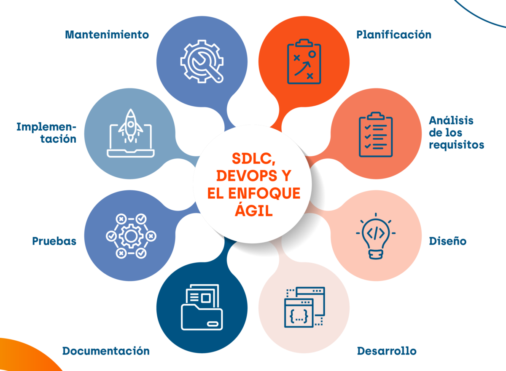

# CICLO DE VIDA DEL SOFTWARE

[Volver a Inicio](../../README.md)

> En desarrollo web, el ciclo de vida del software describe las fases por las que pasa un proyecto desde que se concibe hasta que deja de usarse. Aunque hay distintas metodologías (ágiles, en cascada, etc.), los pasos esenciales suelen ser los mismos, solo cambia cómo se organizan o se solapan.

  

## 1. Planificación y Análisis de Requisitos

- Se definen los objetivos del sitio o aplicación, el público objetivo y las funcionalidades clave.
- Ejemplo: Un cliente quiere una tienda online; se definen cosas como el catálogo, carrito, pasarela de pago y panel de administrador.
- Entregable: Documento de requisitos o backlog inicial.

## 2. Diseño

- Se decide la arquitectura (frontend, backend, base de datos, APIs), se crean prototipos de la interfaz, userstories, diagrama entidad/relación, tecnología a utilizar, etc.
- Ejemplo:
  - Frontend: HTML, CSS, JavaScript/React/Vue.
  - Backend: Node.js con Express/NestJS, base de datos PostgreSQL/MongoDB.
  - Diseño visual en Figma.
- Entregable: Wireframes, mockups, diagramas de arquitectura.

## 3. Desarrollo

- Se escribe el código. Suele dividirse en:
  - Frontend: estructura y diseño que ve el usuario.
  - Backend: lógica de negocio, APIs, manejo de datos.
  - Base de datos: creación de tablas/colecciones y relaciones.
- Ejemplo:
  - Frontend consume una API REST/GraphQL.
  - Backend gestiona usuarios, pedidos y pagos.
- Aquí suelen aplicarse metodologías ágiles para trabajar en sprints (etapas).

## 4. Documentación

- Registro claro de cómo funciona y cómo usar el sistema.
- Incluye:
  - Documentación técnica: estructura de código, API endpoints, dependencias.
  - Documentación de usuario: guías, manuales o tutoriales.
- Ejemplo:
  - API documentada con Swagger o Postman.
  - README.md en GitHub con pasos para instalación y despliegue.

## 5. Pruebas

- Se busca encontrar y corregir errores antes del lanzamiento.
- Ejemplo:
  - Pruebas unitarias (funciones del backend).
  - Pruebas de integración (frontend <-> backend).
  - Pruebas de usabilidad (flujo de usuario en el navegador).
- Herramientas: Jest, Cypress, Playwright, Postman.

## 6. Implementación (Despliegue)

- Se pone el sistema en un servidor accesible para usuarios.
- Ejemplo:
  - Backend desplegado en servicios como AWS, Render, Heroku.
  - Frontend alojado en Vercel, Netlify o en el mismo servidor.
- Configuración de dominio y HTTPS.
- Aquí es común usar integración/despliegue contínuo (CI/CD).

## 7. Mantenimiento

- Se corrigen bugs, se optimiza el rendimiento y se agregan mejoras.
- Ejemplo:
  - Actualizar librerías.
  - Mejorar tiempos de carga.
  - Añadir nuevas funciones como filtros o métodos de pago.

## Fin del ciclo

- El software deja de usarse o se reemplaza.

---

[Volver a Inicio](../../README.md)
